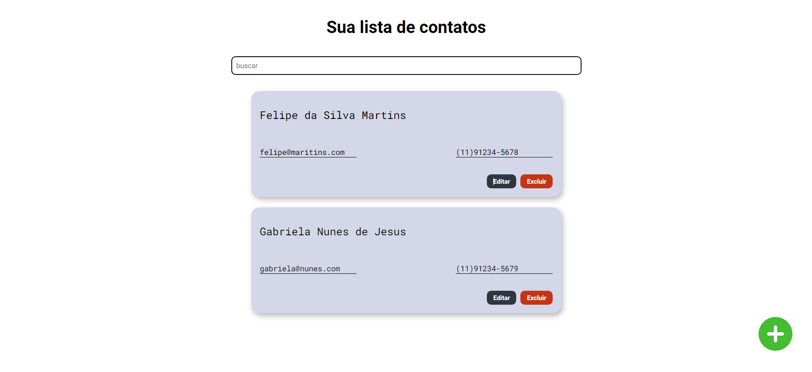

<h1 align="center">
Lista de contato com Redux
</h1>

    

  <a href="#tecnologias">Tecnologias</a>&nbsp;&nbsp;&nbsp;|&nbsp;&nbsp;&nbsp;
  <a href="#projeto">Projeto</a>&nbsp;&nbsp;&nbsp;|&nbsp;&nbsp;&nbsp;
  <a href="#desafio">Desafio</a>&nbsp;&nbsp;&nbsp;|&nbsp;&nbsp;&nbsp;
  <a href="#o-que-aprendi">O que aprendi</a>&nbsp;&nbsp;&nbsp;&nbsp;&nbsp;&nbsp;

## 🚀 Tecnologias

Esse projeto foi desenvolvido com as seguintes tecnologias:

- React
- Typescript
- Prettier
- eslint
- Redux toolkit
- Styled components
- Git e Github

## Projeto

O projeto se trata de uma página para armazenar contatos em uma lista, com design simples para facilitar sua usabilidade, este site foi criado com principal objetivo o estudo e funcionalidades do Redux toolkit

## Desafio

Como parte de um exercicio, o desenvolvedor deve ser capaz de:

- Fazer uma aplicação mostrando todos os contatos salvos
- Criar uma opção para alterar cada contato
- Criar a opçõ de excluir contato e a de cadastrar um novo na lista
- Utilizar redux para realizar o controle dos estados da aplicação

Veja o resultado através do <a href="https://lista-de-contatos-psi.vercel.app/">link do Vercel</a>

## O que aprendi

Com o objetivo de praticas mais o controle de estados com Redux, enquanto faço um site com tecnologias atuais utilizadas no mercado, eu aprendi com este projeto a:

- Criar layouts complexos utilizando styled components
- Estruturar pastas para manter a organização do sistema
- Utilizar typescript para desenvolver sistemas junto a outras tecnologias
- Fazer uso do Redux para centralizar o estado da aplicação em um root reducer
